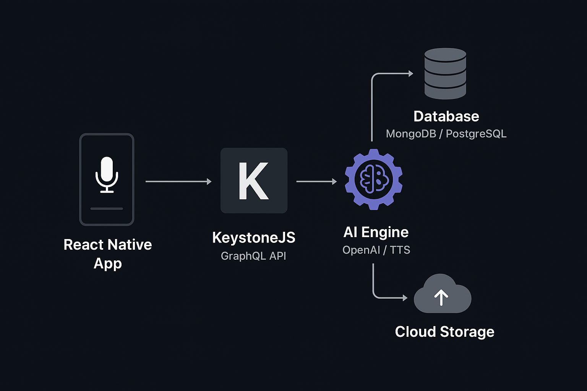

<h1 align="center">🎙️ Podcast AI App</h1>

  <strong>An AI-powered podcast application built with KeystoneJS, GraphQL, and React Native</strong>

  
  
  
  
  

---

## 🚀 Overview
**Podcast AI App** lets you generate, manage, and listen to AI-powered podcasts. It combines **AI text generation**, **text-to-speech**, and a **beautiful mobile experience** powered by **React Native**, while the backend is handled by **KeystoneJS** with **GraphQL API**.

---

## ✅ Features
✔️ AI-generated podcasts (scripts + audio)  
✔️ KeystoneJS Headless CMS with Admin UI  
✔️ GraphQL API for data fetching and mutations  
✔️ Cross-platform mobile app (iOS & Android)  
✔️ Audio streaming and offline downloads  
✔️ Secure user authentication  
✔️ Push notifications for new episodes (roadmap)  

---

## 🏗️ Architecture Diagram

  

**Workflow:**
1. **User** interacts with React Native app → Apollo Client fetches data via **GraphQL**  
2. **KeystoneJS** serves as CMS and API layer  
3. **AI Engine (OpenAI / Hugging Face)** generates podcast scripts and audio  
4. Audio stored in **Cloud Storage (S3/GCS)** → Streamed via mobile app  

---

## 🏗️ Tech Stack
### **Backend**
- [KeystoneJS](https://keystonejs.com/) – Headless CMS with GraphQL API  
- **Node.js** – Server-side runtime  
- **MongoDB / PostgreSQL** – Database  
- **GraphQL** – Flexible API layer  

### **Frontend**
- [React Native](https://reactnative.dev/) – Cross-platform app  
- **Expo** – App development & build  
- **Apollo Client** – GraphQL integration  
- **NativeWind / Styled Components** – Styling  

### **AI**
- [OpenAI](https://openai.com/) – Script generation  
- **Text-to-Speech** – Convert text to audio  

---

## 📂 Project Structure
